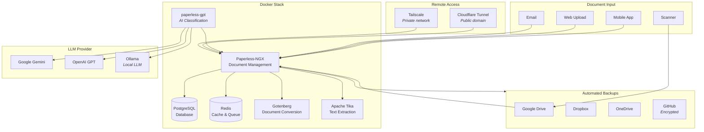

# Paperless Overconfigured

> A production-ready, AI-powered document management stack. One command. A few questions. Stack running.

Paperless-NGX with batteries included: AI classification, automated backups, ASN barcode tracking, secure remote access, and blank page removal. Everything configured with best practices out of the box.

## Quick Start

```bash
bash <(curl -fsSL https://raw.githubusercontent.com/turalaliyev/paperless-overconfigured/main/install.sh)
```

The installer will:
1. Detect your OS and install dependencies
2. Walk you through configuration (access method, AI provider, backups, etc.)
3. Generate all config files and start the stack
4. Set up automated backups if you choose

## Architecture



## What's Included

| Feature | Description |
|---------|-------------|
| **Paperless-NGX** | Core document management with full-text search, tagging, correspondents |
| **AI Classification** | Automatic title, tags, correspondent, document type via LLM (Gemini/GPT/Ollama) |
| **ASN Barcode Tracking** | Physical filing system with QR code labels and fallback OCR detection |
| **Blank Page Removal** | Automatically strips blank pages from scanned PDFs before import |
| **Automated Backups** | Daily/weekly/monthly rotation to Google Drive, Dropbox, OneDrive, or encrypted GitHub |
| **Secure Remote Access** | Tailscale (private) or Cloudflare Tunnel (public domain) — no open ports |
| **Production Hardened** | Memory limits, security headers, log rotation, swap management, fail2ban |

## Access Methods

The installer asks how you want to access Paperless. Choose based on your needs:

| Method | Security | Setup | Best For |
|--------|----------|-------|----------|
| **Tailscale** (recommended) | Private network, encrypted | Install Tailscale on your devices | Personal use, maximum security |
| **Cloudflare Tunnel** | Behind Cloudflare, your domain | Requires a domain + CF account | Sharing with family/team |
| **Both** | Best of both worlds | Tailscale + CF Tunnel | Flexibility |
| **Local only** | Localhost only | Nothing extra | Testing, single machine |
| **Direct expose** | Open to internet | Not recommended | You know what you're doing |

## Configuration

All settings live in a single `.env` file at your install directory. Edit and restart:

```bash
nano ~/paperless/.env
cd ~/paperless && docker compose up -d
```

### Key Settings

| Variable | Description | Default |
|----------|-------------|---------|
| `PAPERLESS_ADMIN_USER` | Admin username | `admin` |
| `PAPERLESS_ADMIN_PASSWORD` | Admin password | Set during install |
| `PAPERLESS_TIMEZONE` | Timezone | Auto-detected |
| `PAPERLESS_OCR_LANGUAGE` | OCR languages | `eng` |
| `LLM_PROVIDER` | AI provider (`googleai`, `openai`, `ollama`, `none`) | Set during install |
| `LLM_MODEL` | Model name | Provider default |
| `ACCESS_METHOD` | How to access (`tailscale`, `cloudflare`, `both`, `local`) | Set during install |
| `ENABLE_BACKUPS` | Automated backups | `false` |

## Backup & Restore

### Automated Backups

If enabled during install, backups run daily at 3:00 AM:

- **Daily** backups: kept 7 days
- **Weekly** backups (Sundays): kept 28 days
- **Monthly** backups (1st): kept 90 days

Destinations: Google Drive, Dropbox, OneDrive, or any rclone remote. Optionally encrypted to a GitHub repo.

### Manual Backup

```bash
cd ~/paperless
./backup.sh
```

### Restore

```bash
cd ~/paperless
./restore.sh
```

Interactive menu to restore from cloud, encrypted file, or local backup.

### Test a Backup

```bash
./restore-test.sh /path/to/backup.zip
```

Non-destructive integrity check.

## Document Workflows

### Import Methods

1. **Web UI** — drag and drop in the browser
2. **Consume folder** — drop files in `~/paperless/consume/`
3. **Email** — configure SMTP and Paperless fetches attachments automatically
4. **Google Drive** — rclone syncs a GDrive folder to the consume directory
5. **Mobile** — use the official Paperless-NGX mobile app

### AI Classification

When AI is enabled, tagged documents are automatically processed:

1. Document arrives in Paperless
2. paperless-gpt picks it up (via `paperless-gpt-auto` tag)
3. LLM analyzes the document content
4. Automatically assigns: title, correspondent, document type, tags, date

### ASN Barcode System

For physical filing with printed labels:

1. Print ASN labels (QR codes with `ASN00001`, `ASN00002`, etc.)
2. Stick label on physical document
3. Scan the document — Paperless reads the barcode automatically
4. If the barcode scanner misses it, the fallback script tries corner-crop + upscale
5. Last resort: OCR text extraction looks for `ASN` pattern

## Services

| Container | Port | Memory | Role |
|-----------|------|--------|------|
| paperless-ngx | 8000 | 3 GB | Core document management |
| paperless-gpt | 8080 | 256 MB | AI classification (optional) |
| postgres | 5432 | 512 MB | Database |
| redis | 6379 | 256 MB | Cache and task queue |
| gotenberg | 3000 | 512 MB | Document conversion |
| tika | 9998 | 512 MB | Text extraction |
| cloudflared | — | 128 MB | Cloudflare Tunnel (optional) |

**Minimum requirements:** 4 GB RAM (8 GB recommended), 2 CPU cores, 20 GB disk

## Management

```bash
cd ~/paperless

# View logs
docker compose logs paperless --tail 50

# Restart
docker compose restart paperless

# Update all containers
docker compose pull && docker compose up -d

# Stop everything
docker compose down

# Check health
docker compose ps
docker compose exec paperless document_sanity_checker
```

## Troubleshooting

### Regenerate API token

```bash
docker compose exec paperless python3 manage.py shell -c "
from django.contrib.auth import get_user_model
from rest_framework.authtoken.models import Token
User = get_user_model()
admin = User.objects.get(username='admin')
token, _ = Token.objects.get_or_create(user=admin)
print(f'Token: {token.key}')
"
```

### Reset admin password

```bash
docker compose exec paperless python3 manage.py changepassword admin
```

### Check disk usage

```bash
du -sh ~/paperless/media/
df -h /
```

## License

MIT
